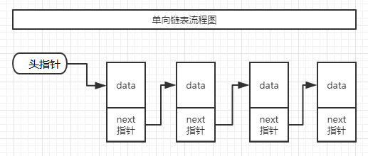

###线性表
1. 线性表: 零个或多个具有相同类型的数据元素的有限序列，数据元素的个数称为线性表的长度
2. 线性表的存储结构: 分为顺序存储结构和链式存储结构两种

### 深拷贝&浅拷贝
浅拷贝: 拷贝的是基本数据类型会直接进行值传递，原数据发生改变拷贝出来的数据相应变量不会发生改变 
拷贝的数据为引用类型，如成员变量是数组或者某个类对象等，浅拷贝是进行引用传递，也就是把引用值(内存地址)复制一份给新对象，因为两个对象的该成员变量指向同一个实例。
这种情况其中一个发生改变都会影响到另一个 

深拷贝：为拷贝的对象的所有成员开辟空间，拷贝整个对象图，相较于浅拷贝速度慢并且开销大,深拷贝实现方式主要有两种： 
1. 通过重写clone方法，需要为每一层对象的每一个对象都实现cloneable接口并重写clone方法，最后在最顶层的类重新clone方法调用所有的clone方法即可，简单来说就是每个对象都进行浅拷贝=深拷贝
2. 通过对象序列化实现深拷贝,相较于第一种繁琐的方式，将对象序列化为字节序列后，默认会将该对象的整个对象图进行序列化再通过反序列化即可实现深拷贝 
注意:如果某个属性被transient(被修饰的变量无法被序列化)修饰那么该属性就无法被拷贝

### 链表结构
1. 由头部指向第一个节点，节点中包含数据信息以及指向下一节点的地址
2. 无需担心扩容，因为每次新增都是修改指向下一节点部分的地址值，末尾节点指向null
3. 插入，删除的时候不像数组那样还需要涉及到移位，链表只需要修改指向下一个地址部分的节点值
4. 查询效率查，不像数组可以根据下标直接查询，每次查询会遍历多次，LinkedList源码中是用二分法遍历

5. 区分单向链表和双向链表，单向链表是值前一部分存储节点信息，后一部分村粗下一节点指向地址。双向链表有三个部分，前一部分存储上一节点地址信息，中间存储节点信息，后一部分存储下一节点地址。LinkedList是双向链表